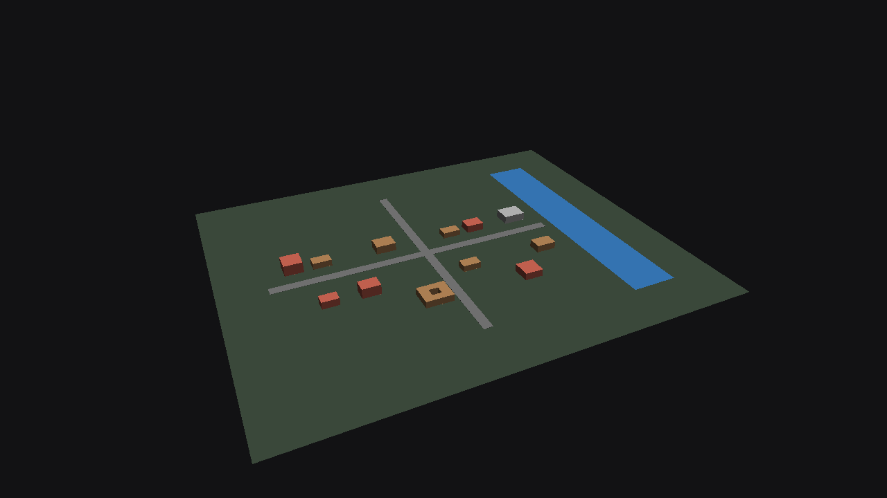

# mappa

A static Babylon.js demo scaffold: a Vite + vanilla JS client that renders a 3D scene with a bottom-bar timeline scrubber and a side panel, driven by static JSON data baked ahead of time. It ships as a static site (no server) intended for GitHub Pages.

See `docs/demo-slice-plan.md` for the full implementation plan and the canonical spec folder for design details. Run `npm install && npm run dev` to start the local dev server, or `npm run build && npm run preview` to check the production build.

## Verified

End-to-end verified in Safari against `npm run preview` (see `.superpowers/sdd/task-4-report.md` for full evidence): `bake/` tests 28/28, timeline scrub sweep across 1920/1935/1950/1963.9/1964.5/1970/1975 matches `public/v0/timeline.json` exactly (visible-mesh count grows to 15, drops by 4 at the 1964 quake, recovers to 14 by 1970), building extrusions sit base-at-ground with correct height, and the default camera is centered on the town at the region's configured height/heading/pitch. Screenshots (`docs/verify/`, captured via an in-page `CreateScreenshotUsingRenderTargetAsync` render, no OS screen-recording permission needed) confirm the scene renders upright and lit, not blank:

