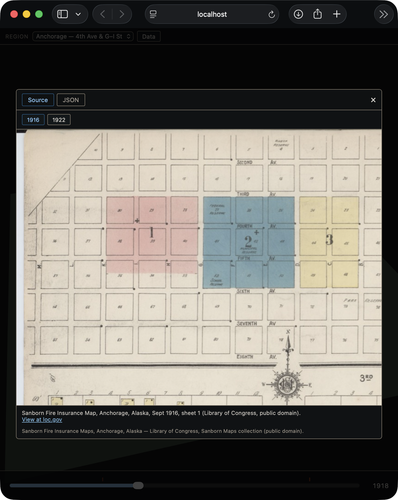

# mappa

**Live demo: https://jadavenp.github.io/mappa/**

A static Babylon.js demo scaffold: a Vite + vanilla JS client that renders a 3D scene with a bottom-bar timeline scrubber and a side panel, driven by static JSON data baked ahead of time. It ships as a static site (no server) served from GitHub Pages.

See `docs/demo-slice-plan.md` for the full implementation plan and the canonical spec folder for design details. Run `npm install && npm run dev` to start the local dev server, or `npm run build && npm run preview` to check the production build.

The `reg_anchorage_downtown` region traces real buildings from Sanborn Fire Insurance Maps of Anchorage, Alaska (Sept 1916 sheet 1 and Sept 1922 sheet 3), Library of Congress, Sanborn Maps collection, public domain. The source sheets and full citations are viewable in-app via the "Data" button's Source tab. `reg_port_alder` is a fictional demo region with hand-invented data (no real source imagery).

To deploy: `python3 bake/bake.py && npm run build`, then push the contents of `dist/` to the `gh-pages` branch (Pages serves that branch; pushing `main` alone does not update the site).

## Verified

End-to-end verified in Safari against `npm run preview`: `bake/` tests 33/33, timeline scrub sweep across 1920/1935/1950/1963.9/1964.5/1970/1975 matches `public/v0/reg_port_alder/timeline.json` exactly (visible-mesh count grows to 15, drops by 4 at the 1964 quake, recovers to 14 by 1970), building extrusions sit base-at-ground with correct height, and the default camera is centered on the town at the region's configured height/heading/pitch. Screenshots (`docs/verify/`, captured via an in-page `CreateScreenshotUsingRenderTargetAsync` render, no OS screen-recording permission needed) confirm the scene renders upright and lit, not blank:

`reg_anchorage_downtown` verified the same way: probe times derived directly from `public/v0/reg_anchorage_downtown/timeline.json`'s cumulative appear/alter/disappear entries and asserted exact against `getState().visibleCount` — 0 before 1915, 86 from 1915, 93 through the 1917–1918 construction window, dropping to 57 after the 1919 demolition wave (holds through 1923). `webglVersion` is 2, `meshCount` is 97 (matching the baked state count), and the two survey-event tick marks (Sept 1916, Sept 1922) render in the timeline bar. The region picker `<select>` lists both regions with the URL-selected one marked `selected`. The "Data" inspector opens over the scene, its Source tab serves both the 1916 and 1922 Sanborn sheets (each confirmed 200 OK) with LoC attribution, its JSON tab's `<pre>` contains `"reg_anchorage_downtown"`, and Escape closes the overlay:

